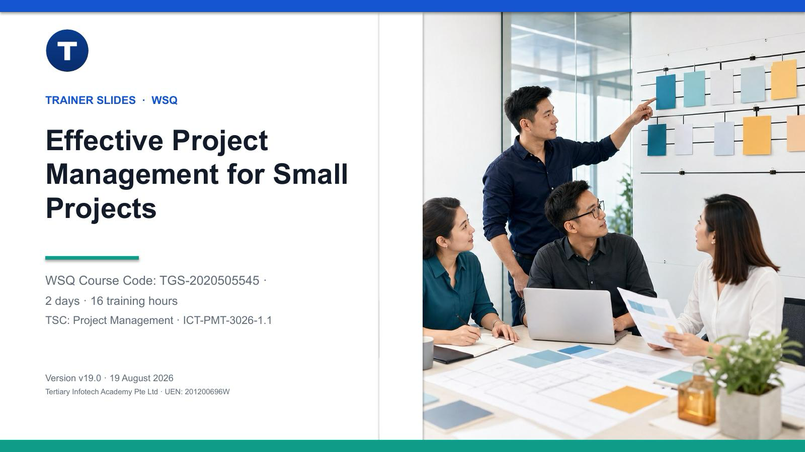

# Effective Project Management for Small Projects

WSQ courseware for **TGS-2020505545**, covering the complete small-project lifecycle: initiation, planning, execution, monitoring and controlling, and closure.



## Current release

- Version: **v19.0**
- Release date: **19 August 2026**
- Duration: **2 days / 16 training hours**
- TSC: **Project Management — ICT-PMT-3026-1.1**
- Learning outcomes: **LO1–LO7**

## Package contents

- A 200-slide visual, concept-led trainer deck in editable PowerPoint and PDF formats.
- A 53-page Learner Guide and 12-page Lesson Plan in editable DOCX and PDF formats.
- Twelve connected, self-contained activity packs based on the HarbourHub Fresh Click & Collect Pilot.
- Editable project tools for selection, business cases, charters, requirements, WBS, schedules, budgets, delivery method, quality, risk, stakeholders, RACI, resources, procurement, Kanban, earned value, issues, change, acceptance, handover, retrospectives and benefits tracking.
- Printable worksheets, datasets, evidence requirements and acceptance criteria.

## Repository structure

```text
courseware/   Current PPTX, PDF, Learner Guide and Lesson Plan
activities/   Twelve learner-facing activity packs and editable tools
README.md     Release overview
```

Detailed procedures are intentionally kept in the Learner Guide and activity packs. Slides focus on concepts, decision frameworks and visual explanation.

## Source alignment

The release retains the seven-topic syllabus and assessment method stated in the v17 master trainer deck. It explicitly maps those topics to all five lifecycle phases and strengthens the treatment using the supplied Agile Project Management deck, PMP deck and Project Management Templates Guide while remaining scoped to small-project application.

## Assessment boundary

Assessment papers and answer keys are not published in this public repository. Assessment instruments remain controlled trainer materials and must be verified against the authenticated LMS-TMS source before revision.

## Credits

Developed by Tertiary Infotech Academy Pte Ltd.
